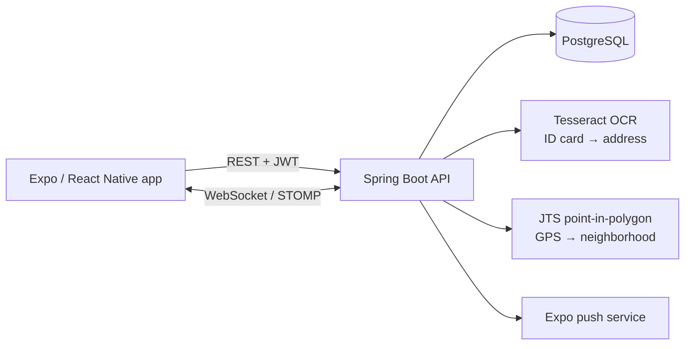

# NeighborhoodWatch — community safety app for neighborhoods in Romania

A mobile app where residents report incidents with photos or video, chat with their neighbors in real time and receive push alerts. Each user is **assigned to their neighborhood automatically**, using the phone's GPS location or their ID card.

**[TODO: add 2–3 app screenshots side by side]**

## Features

- **Automatic neighborhood assignment.** The user's GPS location is matched against neighborhood boundary polygons with a point-in-polygon test (JTS).
- **ID-card verification.** As an alternative to GPS, **OCR on the Romanian ID card** (Tesseract, `ron` language data) extracts the address and assigns the neighborhood.
- **Incident reports.** Reports have categories, comments, and photo/video attachments.
- **Real-time communication.** Neighborhood chat and live notifications run over WebSockets (STOMP), plus Expo push notifications.
- **Authentication.** Spring Security with JWT, and a token blacklist on logout.
- **API documentation.** Available through Swagger UI (springdoc).



## Tech stack

**Backend:** Java 17, Spring Boot 3, Spring Security, JPA/Hibernate, PostgreSQL, WebSockets (STOMP), Tesseract (tess4j), JTS, springdoc-openapi
**Mobile:** Expo, React Native (JavaScript), NativeWind, Expo Notifications

## How to run

**Backend:**

```bash
cd neighborhood-watch-api
# set the datasource URL, username, password and JWT secret
# (preferably via environment variables, not in application.properties)
./mvnw spring-boot:run            # Swagger UI at /swagger-ui.html
```

**Mobile app:**

```bash
cd neighborhood-watch-front
npm install
npx expo start
```

## What I'd improve

- **Configuration.** Load the JWT secret and database credentials from environment variables. Upgrade Spring Boot from the `3.5.0-M2` milestone to a stable release.
- **Media storage.** Store uploaded media in object storage (e.g. S3) instead of a local `uploads/` folder. Strip EXIF location data from uploaded photos.
- **Tests and Docker.** Add integration tests for incident and neighborhood flows, and a Docker Compose setup with PostgreSQL.

## My contribution

Bachelor's thesis project, designed and built entirely by me, from the data model to the mobile app.

- **Backend architecture:** Spring Boot API organized in domain / application / infrastructure / presentation layers, with 12 JPA entities, 12 controllers and 47 REST endpoints, documented with Swagger.
- **Neighborhood assignment:** GPS point-in-polygon matching with JTS against neighborhood boundaries stored in PostgreSQL. An alternative flow runs Tesseract OCR (Romanian) on an ID card, extracts the street address with regex, geocodes it through OpenStreetMap Nominatim and maps it to a neighborhood.
- **Real-time layer:** WebSocket channels for neighborhood chat and live notifications, plus Expo push notifications to mobile devices.
- **Security:** JWT authentication with Spring Security, a token blacklist on logout, and two roles (resident and neighborhood admin).
- **Mobile app:** Expo / React Native app with sign-up and neighborhood verification, an incident feed, reports with photos or videos and an anonymous option, comments, chat, emergency contacts, notifications and profiles.

**[TODO: solo or team project? If team: size and what you built]**

